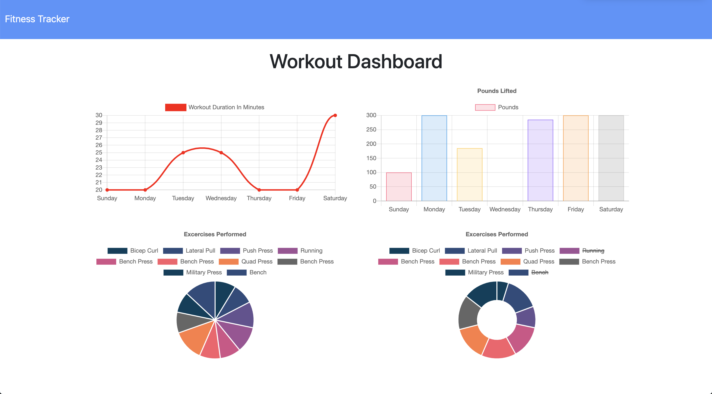

  # Fitness Tracker
  
  ## Description
  Fitness Tracker is an app that allows the user to record and keep track of daily cardio and/or resistance strength exercises.

  ## Contributing
  
  Languages and Frameworks Used: JavaScript, Node.js, jQuery, MongoDB, Mongoose
  
  ## Questions
  
  Please contact [sharlenemay](https://github.com/sharlenemay) at sharleneminosa@gmail.com for questions.